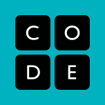
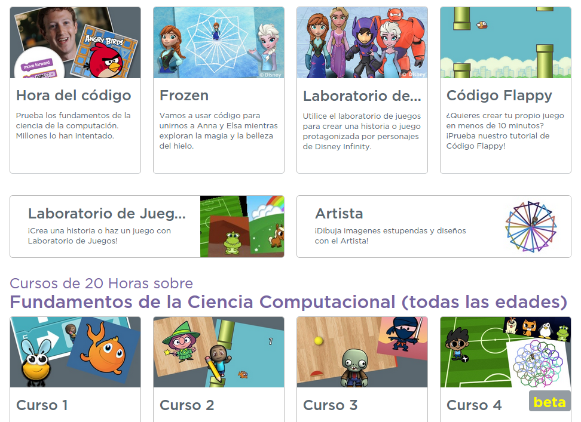

# Iniciación a la programación con bloques

[Code.org](https://code.org/)

### code.org

#### ¿no son todos .com?

#### ¿quién está detrás?

* * *

### Vamos a hacer pequeños programas para ayudar a nuestros amigos

### ¿Frozen? ¿Angry birds? ¿Flappy bird?

[nivel 1](https://studio.code.org/hoc/1/)

## Otras iniciativas

[Aprende a programar con blocky](http://www.aprendeprogramando.es/blockly/modules)
