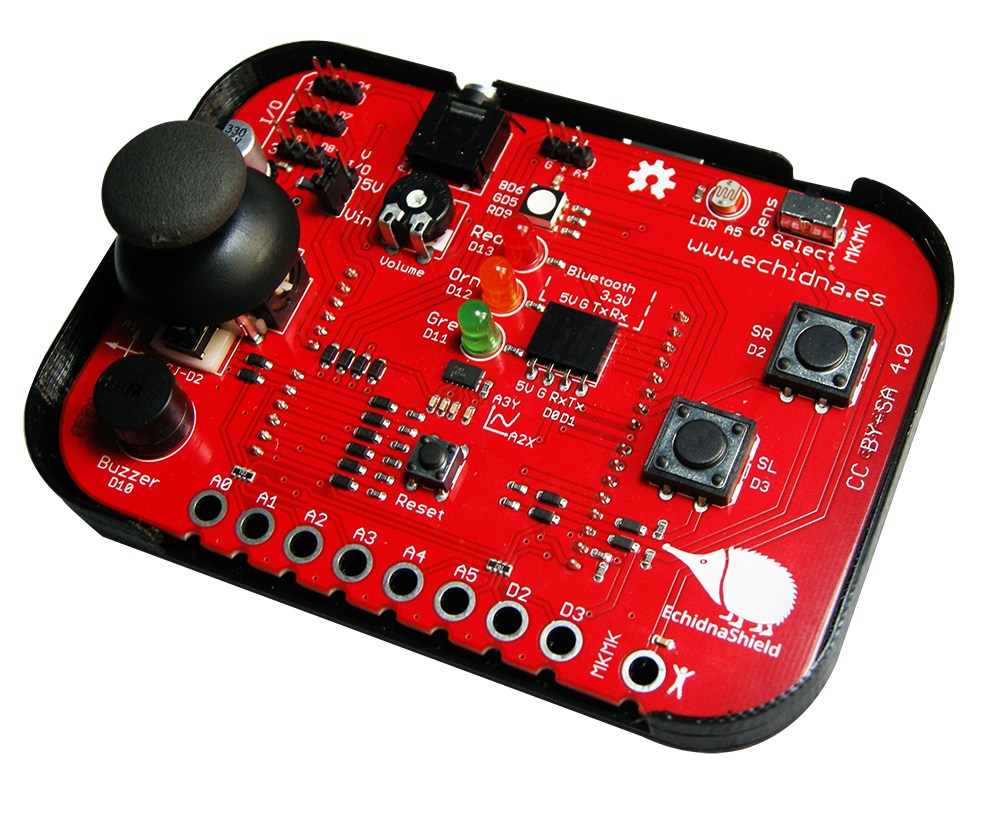

# Introducción

Claramente Scratch es la base de la programación para primaria, y para darle interacción y conexión con el mundo físico a la vez que una introducción a la robótica debemos completarlo con Makey-Makey

Makey-Makey es una placa basada en Arduino que nos facilita la conexión de ordenador con circuitos de materiales conductores (papel de aluminio, frutas, clips, grafito, etc). Emular a un teclado y/o ratón con lo que se puede usar en cualquier programa. No necesita drivers y es muy sencilla de instalar.

Si queremos avanzar algo más en serio con la robótica podemos introducir más tecnología, como puede ser Echidna si queremos ir hacia el estándar de facto de Arduino o usando micro:bit si queremos usar recursos más actuales.

Echidna es un shield de arduino con un montón de sensores que nos permite aprender Arduino sin tener que hacer montajes. También sirve como Makey-Makey y se puede conectar a Scratch. Cuesta unos 35eu

   
